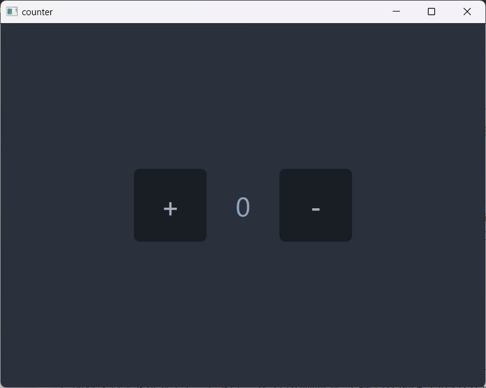
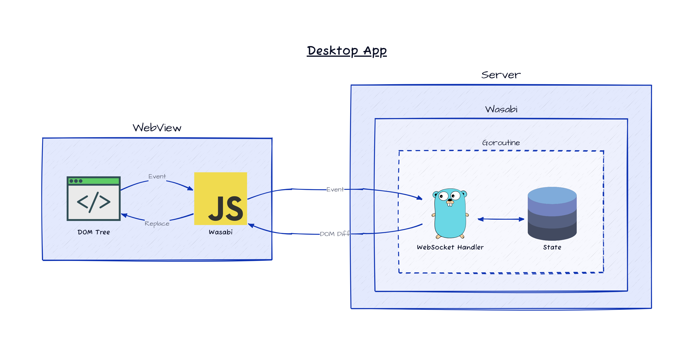
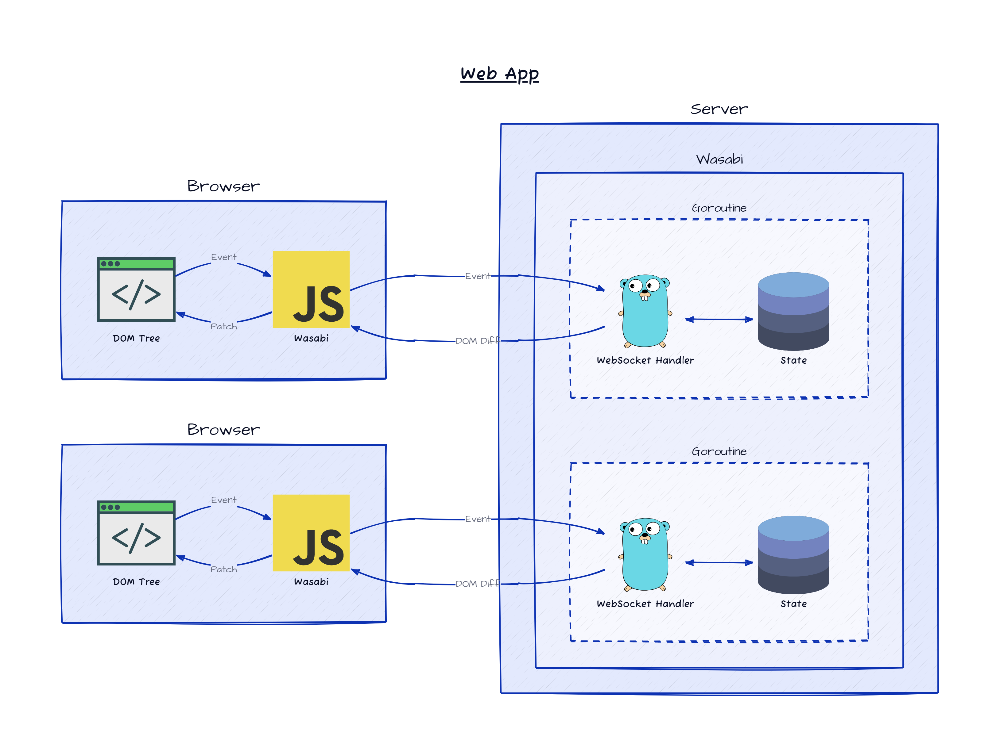

# Wasabi
Wasabi is a cross-platform UI framework for creating desktop and web applications using only Go.

## Features
- Wasabi enables you to create both desktop and web apps using only Go. A little knowledge of HTML/CSS can help.
- It works seamlessly with CSS frameworks like [Tailwind CSS](https://tailwindcss.com/) and [daisyUI](https://daisyui.com/).
- It simplifies development by unifying backend and frontend, minimizing data transfer and eliminating the need for JavaScript or APIs.
- It has declarative UI flavor.

## A Quick Overview
This example showcases a simple counter application created using Wasabi.
The source code of this example is available [here](example/desktop/main.go)

This example uses [daisyUI](https://daisyui.com/) as a CSS framework.

### Directory tree

```
root
├── main.go
└── assets
    ├── daisyui.css
    └── tailwind.js
```

### Source (main.go)
```go
package main

import (
    "embed"
    "strconv"

    w "github.com/i2y/wasabi"
    a "github.com/i2y/wasabi/modifier/attr"
)

//go:embed assets
var assets embed.FS

func main() {
    app := w.NewDesktopApp("counter", 800, 600, w.Assets(assets))
    app.Run(counter)
}

func counter(f *w.Factory) w.Element {
    count := w.NewState(0)
    return f.Div(a.Class("flex items-center justify-center w-screen h-screen"))(
        f.Button(
            a.Class("btn text-4xl w-24 h-24 items-center justify-center"),
            a.OnClick(func() { count.Set(count.Get() + 1) }),
        )(
            f.Text("+"),
        ),
        f.Reactive(count, func() w.Element {
            return f.Div(a.Class("text-slate-400 text-4xl w-24 h-24 flex items-center justify-center"))(
                f.Text(strconv.Itoa(count.Get())),
            )
        }),
        f.Button(
            a.Class("btn text-4xl w-24 h-24 items-center justify-center"),
            a.OnClick(func() { count.Set(count.Get() - 1) }),
        )(
            f.Text("-"),
        ),
    )
}

```

### Build and Run
```sh
go build main.go
./main
```

### Screen Shot


## Dependencies
Wasabi currently depends on the following packages.
Thanks to the creators and contributors of each package.
- [go-webview2](https://github.com/jchv/go-webview2) for windows
- [webview](https://github.com/webview/webview) for other platforms
- [nhooyr.io/websocket](https://github.com/nhooyr/websocket) for communication between Go and webview
- [Hotwired Turbo](https://turbo.hotwired.dev/) for the same purpose as above
- [EventBus](https://github.com/asaskevich/eventbus)
- and libraries that the above libraries depend on

These dependencies may be changed for internal implementation reasons.

## Distribution/Packaging
If you intend to package and distribute your application, you essentially just need to execute the `go build` command with the suitable `GOOS` and `GOARCH` parameters. Nonetheless, there are several platform-specific considerations to bear in mind.

### MacOS
You can create an application bundle (`.app` package) using tools like [appify](https://github.com/machinebox/appify) or [macappshell](https://github.com/Xeoncross/macappshell).

### Windows
Your application can be run in the background by specifying the `-ldflags "-H windowsgui"` option during the `go build` process. For instance:
```
go build -ldflags "-H windowsgui" main.go
```
Additionally, you can utilize tools such as [go-winres](https://github.com/tc-hib/go-winres), [rsrc](https://github.com/akavel/rsrc), or [GoVersionInfo](https://github.com/josephspurrier/goversioninfo) to embed resources, like the application icon, into your Windows app.

## Web App Example
The source code for running the aforementioned Counter desktop app example as a web application can be found [here](example/web/main.go).

### Directory Structure
```
root
├── main.go
└── counter/assets
    ├── daisyui.css
    └── tailwind.js
```

### Source (main.go)
```go
package main

import (
    "embed"
    "net/http"
    "strconv"

    w "github.com/i2y/wasabi"
    a "github.com/i2y/wasabi/modifier/attr"
)

//go:embed counter/assets
var assets embed.FS

func main() {
    handler := w.NewHTTPHandler("counter", "/counter", counter, w.Assets(assets))
    http.ListenAndServe(":8080", handler)
}

func counter(f *w.Factory) w.Element {
    count := w.NewState(0)
    return f.Div(a.Class("flex items-center justify-center w-screen h-screen"))(
        f.Button(
            a.Class("btn text-4xl w-24 h-24 items-center justify-center"),
            a.OnClick(func() { count.Set(count.Get() + 1) }),
        )(
            f.Text("+"),
        ),
        f.Reactive(count, func() w.Element {
            return f.Div(a.Class("text-slate-400 text-4xl w-24 h-24 flex items-center justify-center"))(
                f.Text(strconv.Itoa(count.Get())),
            )
        }),
        f.Button(
            a.Class("btn text-4xl w-24 h-24 items-center justify-center"),
            a.OnClick(func() { count.Set(count.Get() - 1) }),
        )(
            f.Text("-"),
        ),
    )
}
```

The key differences from the desktop app include the use of `w.NewHTTPHandler` instead of `w.NewDesktopApp`. While Wasabi's backend core uses a websocket, it's fundamentally just a net/http handler. This not only enables users to create web apps using Wasabi, but also allows for the integration of Wasabi with other web frameworks.

### Build and Run
```console
go build main.go
./main
```

You can access the application at `http://localhost:8080/counter`.

## Architecture




The communication between the Go backend and the browser/webview is done via a websocket. The Go backend sends the HTML/CSS/JS code to the browser/webview, and the browser/webview sends the events to the Go backend.

## License
[MIT License](https://github.com/i2y/wasabi/blob/main/LICENSE)
